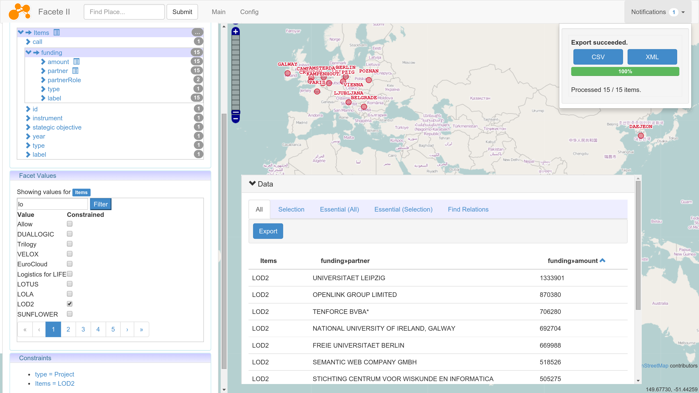

# Facete2 - A faceted browser for (spatial) RDF data




## Quick Setup

### Debian Packages

#### Stable Versions
Stable versions will soon be uploaded to the  [Linked Data Stack Repository](http://stack.linkeddata.org/). Instructions will follow.

#### Development Versions
For the latest development version (built on every commit to master) perform the following steps

Create the file

    /etc/apt/sources.list.d/cstadler.aksw.org.list

and add the content

    deb     http://cstadler.aksw.org/repos/apt precise main contrib non-free

Import the public key with

    sudo su
    wget -O - http://cstadler.aksw.org/repos/apt/conf/packages.precise.gpg.key | apt-key add -

Please note that you have to adjust some settings; check the prerequisites section of [this guide](https://github.com/AKSW/Sparqlify/tree/master/sparqlify-debian-tomcat7).

Install the application with

    sudo apt-get install facete2-tomcat7

Point your browser to

[http://localhost:8080/facete2](http://localhost:8080/facete2)


## Build
The build requires the `node` command to be present. Some packages only provide the nodejs command, in this case, build can be fixed by adding this symbolic link:

```sh
sudo ln -s /usr/bin/nodejs /usr/bin/node
```

## Dataset requirements

* All properties must be declared with `?x a <http://www.w3.org/1999/02/22-rdf-syntax-ns#Property>
* Geo-Vocabulary is by default configured to wgs84; GeoSPARQL and Virtuoso are supported in the API, however at present there is no switch in the user interface
* Full text functionality currently requires bif:contains (Virtuoso-specific) to work on `rdfs:label`'s. In order to create the index, open Virtuoso's isql client and run `DB.DBA.RDF_OBJ_FT_RULE_ADD(null, null, 'All');`


## Dependencies

This project is built on these of our other projects:

* [JAvaScript Suite for Sparql Access (Jassa)](https://github.com/GeoKnow/Jassa)
* [Jassa User Interface Components](https://github.com/GeoKnow/Jassa-UI-Angular)
* [jena-sparql-api](https://github.com/AKSW/jena-sparql-api)
* [Sparqlify](https://github.com/AKSW/Sparqlify)

