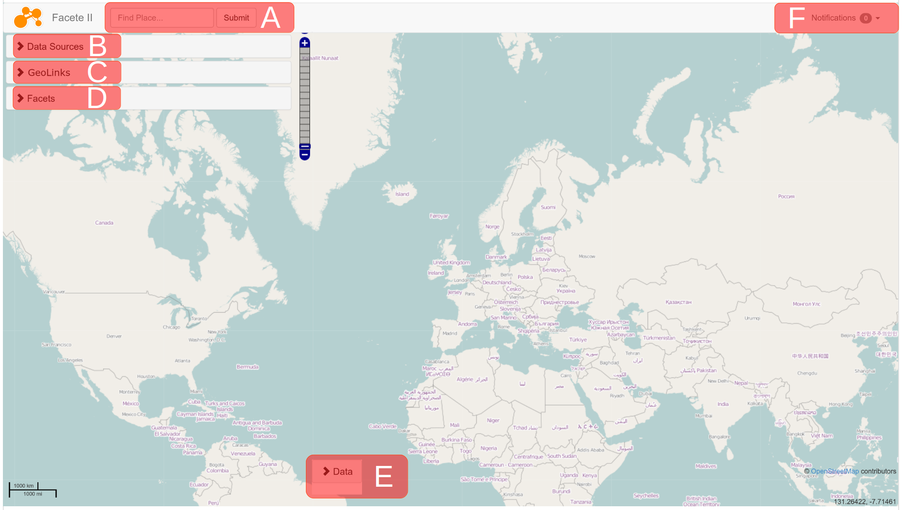
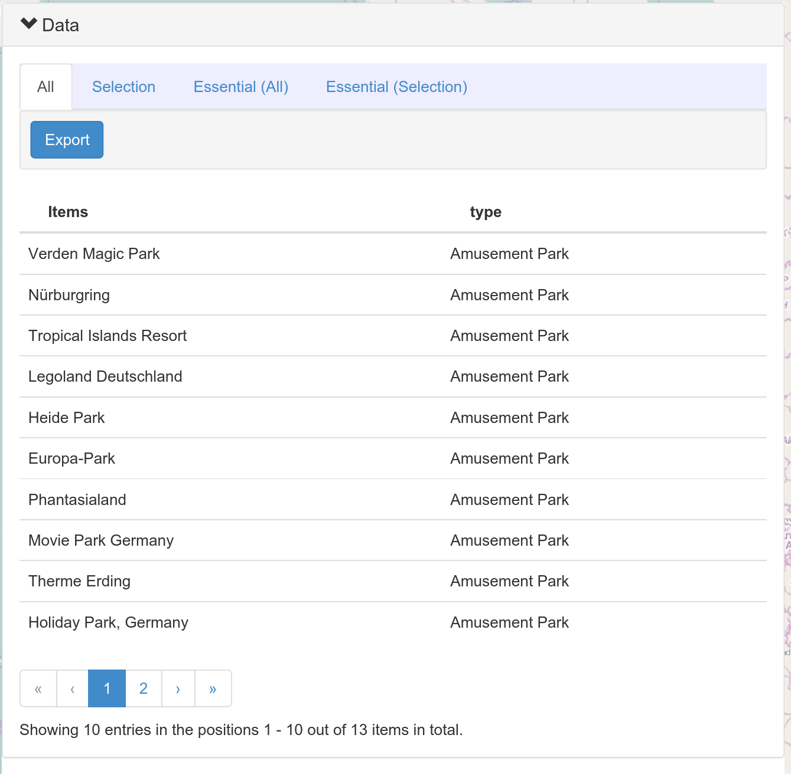

## Facete2 User Guide

### Overview

The highlighted areas serve the following purposes:

* A: Place Search: Find places on the map powered by the [OpenStreetMap Nominatim](http://nominatim.openstreetmap.org) service
* B: Data Source Management: Register and unregister Data sources.
* C: GeoLinks: Enables selection by which properties te data should be shown on the map. For instance, people could be linked to the map either by birth place or death place.
* D: Faceted Search controls: Lists the available properties of the resources matching filter criteria, and enables adding/removing of filters.
* E: Data View: Tabular views of attribute values associated with the resources can be viewed and exported.
* F: Notifications: The status of data exports can be reviewed here.

### The Facet View

This area is composed of three sub-widget:

* Facet Tree: The tree view
* Facet Values: This widget shows all values for a selected facet.
* Constraints: This list summarizes all active constraints. Constraints can be removed by clicking on it.

### The Data View

The data view contains the following tabs with the corresponding data tables:
* All: This table shows all resources matching the constraints, as well as the columns linked to facets.
* Essential: This is a pre-configured view for convenience, which shows the resources, their types, geo-coordinates and related labels.

The tabs having `(Selection)` show the subset of the respective subset of the data that corresponds to any selected marker on the map. If no markers are selected, the table will be empty.

Clicking the `Export` button will schedule a server-side export of all the data in the respective table and a new notification with a progress-indicator will be added to the `Notifications` list.

Furthermore, the following actions can be performed:

* Hovering the mouse cursor over an item in the table causes a small `*` symbol to appear. Clicking it will show a context menu that enables viewing resources in a new browser tab, or copying the value to the clip-board.
* Hovering the mouse cursor over the table headings will show controls for ordering the columns or removing them from the table
* Hold Shift while clicking on order buttons to sort multiple columns

### Notifications

At present, notifications are only used to inform about the progress of exports and provide access to the
downloads once they are finished.
Downloads can be obtained in CSV and XML format:

* XML: The XML is the SPARQL result set of the query that was used to create the table view from which the export was started.
* CSV: The CSV format is similar to the SPARQL result set, with the minor difference, that RDF terms are converted to "CSV-friendly" representations and language tags are mapped to additional columns (rather than making them part of the value).

